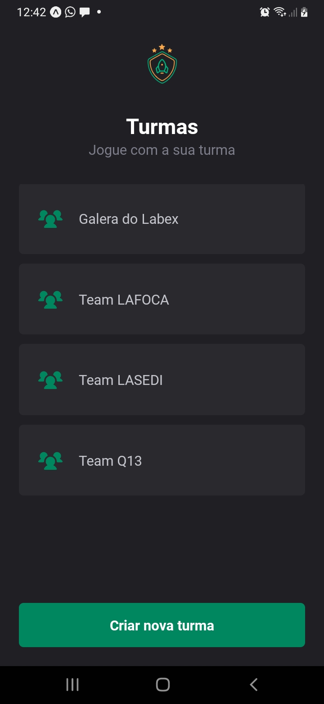
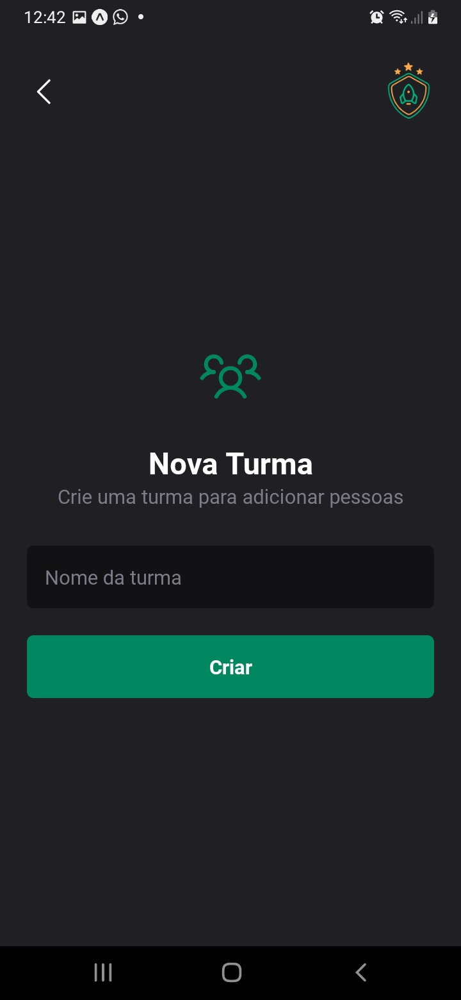
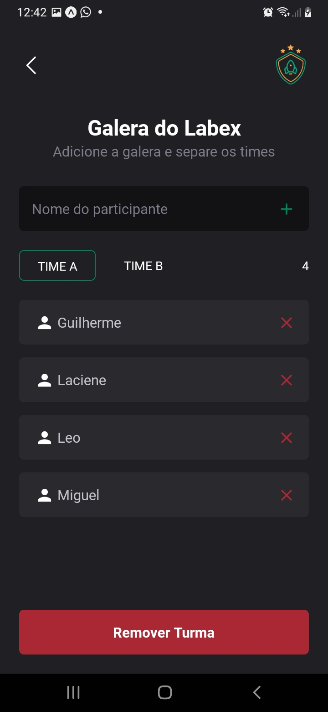

<h1 align="center">
    
</h1>

<h1 align="center">
    
    
    
</h1>


## 💻 Projeto IGNITE TEAMS

---

Desenvolvimento do projeto Ignite Teams. A proposta de ajudar a organizar pessoas que se reúnem para jogar em turmas. É um aplicativo com navegação em pilhas onde é possível cadastrar/remover turmas/membros do time e armazenar essas informações no armazenamento local do aparelho, preservando os dados mesmo que o app seja fechado. Seguiremos um guia de estilo para implementar nosso tema no Styled Components a fim de manter um padrão em todo o app.

## :rocket: Tecnologias Utilizadas
---

-  [Typescript](https://www.typescriptlang.org/)
-  [axios](https://github.com/axios/axios)

## 🔖 Configurações do Layout

---

```bash
  # 💻 Instalar extensão do vscode
      ✨ vscode-style-components

  # 💻 Instalar extensão do TypeScript Error para verificação de erros
      ✨ TypeScript Error Translator

  # 💻 Comando para criar o projeto
      ✨ npx create-expo-app --template

  # 🛠️ Comando para executar o projeto
      ✨ expo start

  # 🛠️ Comando para instal o Path Mapping no projeto,  Essa estratégia facilita bastante a importação dos arquivos no código ao trabalharmos com o @ em vez de vários ../
      ✨ yarn add --dev babel-plugin-module-resolver

  # 🛠️ Comando para instalar o styled component, que permite utilizar css no javascript
      ✨ yarn add styled-components
      ✨ yarn add --save-dev @types/styled-components @types/styled-components-react-native

  # 🛠️ Comando para adicionar a biblioteca de fontes do Expo que disponibiliza basicamente todas as fontes Google
      ✨ npx expo install @expo-google-fonts/roboto

  # 🛠️ Comando para adicionar a biblioteca de ícones
      ✨ yarn add phosphor-react-native
      ✨ npx expo install react-native-svg

  # 🛠️ Comando para adicionar a biblioteca de navegação entre telas
      ✨ yarn add @react-navigation/native

    ## 🔖 Dependências que o react navigation precisa
        ✨ npx expo install react-native-screens react-native-safe-area-context
        ✨ yarn add @react-navigation/native-stack

    # 🛠️ Biblioteca para realizar requisições na api
    ✨ yarn add axios
```
## :arrow_forward: Como Executar

---

```bash
# clonar o repositório
git clone https://github.com/lacymelo/igniteteams.git

# entrar na pasta
cd igniteteams

# instalação das dependências
yarn install

# executar o projeto
expo start
```
## :man_student: Autor
---

Feito com ♥ by Laciene Melo:wave: [#lacymelo](https://github.com/lacymelo)
